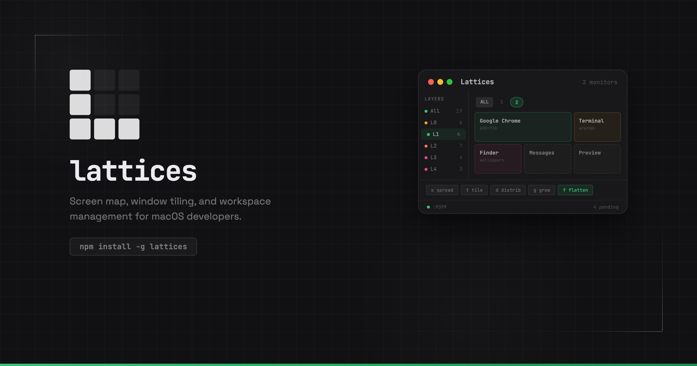

<picture>
  
</picture>

# lattices

The agentic workspace manager for macOS.

Lattices turns your Mac workspace into a coherent API, so agents can see and
control windows, tmux sessions, screen text, and layouts. It also gives you
an assistant to control that workspace in plain language.

**[lattices.dev](https://lattices.dev)** · [Docs](https://lattices.dev/docs/overview) · [Download](https://github.com/arach/lattices/releases/latest)

## Install

### Download the app

Grab the signed DMG from the [latest release](https://github.com/arach/lattices/releases/latest):

```sh
# Or direct download:
curl -LO https://github.com/arach/lattices/releases/latest/download/Lattices.dmg
open Lattices.dmg
```

Drag **Lattices.app** into Applications. On first launch, a setup wizard
walks you through granting Accessibility, Screen Recording, and choosing
your project directory.

### Install the CLI

```sh
npm install -g @lattices/cli
```

The CLI and app work independently — use either or both.

### Build from source

```sh
git clone https://github.com/arach/lattices.git
cd lattices

# Install CLI dependencies
npm install

# Build/install/relaunch the dev app at the stable permission target
./run.sh
```

To build a signed, notarized DMG for distribution:

```sh
# Requires a Developer ID certificate and notarytool keychain profile
./tools/release/build-dmg.sh

# Update v<package.json version> and upload the DMG to GitHub Releases
./tools/release/ship.sh
```

## Quick start

```sh
# Launch the menu bar app
lattices app

# Open the command palette from anywhere
# Cmd+Shift+M
```

## Persistent terminal sessions

Declare your dev environment in a `.lattices.json`: which panes, which
commands, what layout. Lattices builds it, runs it, and keeps it alive.
Close your laptop, reboot, come back a week later — your editor, dev
server, and test runner are exactly where you left them.

```sh
cd my-project && lattices start
```

No config? It opens a shell in the project and, when it can, starts your
detected dev command in a second pane.

### Configuration

Drop a `.lattices.json` in your project root:

```json
{
  "ensure": true,
  "panes": [
    { "name": "shell", "size": 60 },
    { "name": "server", "cmd": "pnpm dev" },
    { "name": "tests",  "cmd": "pnpm test --watch" }
  ]
}
```

### Layouts

```
2 panes              3+ panes

┌──────────┬───────┐ ┌──────────┬───────┐
│  shell   │server │ │  shell   │server │
│  (60%)   │(40%)  │ │  (60%)   ├───────┤
└──────────┴───────┘ │          │tests  │
                     └──────────┴───────┘
```

### Workspace layers

Group projects into switchable contexts. `Cmd+Option+1` tiles your
frontend and API side by side. `Cmd+Option+2` for the mobile stack.
Sessions stay alive across switches.

### Tab groups

Bundle related repos as tabs in one session. Each tab gets its own
pane layout from its `.lattices.json`.

```sh
lattices group vox         # Launch iOS, macOS, Web, API as tabs
lattices tab vox iOS       # Switch to the iOS tab
```

## Window tiling and awareness

A native menu bar app tracks every window across all your monitors.
Tile with hotkeys, organize into switchable layers, snap to grids.

It reads your windows too — extracting text from UI elements every
60 seconds and running Vision OCR on background windows every 2 hours.
Everything is searchable.

```sh
lattices scan                  # View current screen text
lattices scan search "error"   # Search across all indexed text
lattices scan recent           # Browse scan history
lattices scan deep             # Trigger a Vision OCR scan now
```

## Voice commands (beta)

Speak to control your workspace — tile windows, search, focus apps,
and launch projects with natural language. Powered by
[Vox](https://github.com/arach/vox) for transcription and
local NLEmbedding for intent matching, with Claude fallback for
ambiguous commands.

Trigger with `Hyper+3` (configurable). Press Space to speak, Space to
stop. The panel shows what was heard, the matched intent, extracted
parameters, and execution results.

## A programmable desktop

The menu bar app runs a daemon with 35 RPC methods and 5 real-time
events over WebSocket. Anything you can do from the app, an agent or
script can do over the API.

```js
import { daemonCall } from '@lattices/cli/daemon-client'

// Search windows by content — title, app, session tags, OCR
const results = await daemonCall('windows.search', { query: 'myproject' })

// Launch and tile
await daemonCall('session.launch', { path: '/Users/you/dev/frontend' })
await daemonCall('window.tile', { session: 'frontend-a1b2c3', position: 'left' })

// Read the screen
await daemonCall('ocr.scan')
const errors = await daemonCall('ocr.search', { query: 'error OR failed' })
```

Or from the CLI:

```sh
lattices search myproject           # Find windows by content
lattices search myproject --deep    # Include terminal tab/process data
lattices place myproject left       # Search + focus + tile in one step
```

Claude Code skills, MCP servers, or your own scripts can drive your
desktop the same way you do.

## CLI

```
lattices                    Show workspace status and common commands
lattices start              Create or reattach to current project session
lattices tmux               Alias for lattices start
lattices init               Generate .lattices.json
lattices ls                 List active sessions
lattices kill [name]        Kill a session
lattices search <query>     Search windows by title, app, session, OCR
lattices search <q> --deep  Deep search: index + terminal inspection
lattices place <query> [pos]  Deep search + focus + tile
lattices focus <session>    Raise a session's window
lattices tile <position>    Tile frontmost window
lattices group [id]         Launch or attach a tab group
lattices tab <group> [tab]  Switch tab within a group
lattices scan               View current screen text
lattices scan search <q>    Search indexed text
lattices scan deep          Trigger Vision OCR now
lattices app                Launch the menu bar app
lattices help               Show help
```

## Requirements

- macOS 26.0+
- Node.js 18+

### Optional

- tmux for persistent terminal sessions (`brew install tmux`)
- Swift 6.2 / Xcode 26+ to build the menu bar app from source

## Docs

Full documentation at [lattices.dev/docs](https://lattices.dev/docs/overview), including:

- [API reference](https://lattices.dev/docs/api) — all 35 daemon methods
- [Layers](https://lattices.dev/docs/layers) — workspace layers and tab groups
- [Voice commands](https://lattices.dev/docs/voice) — Vox integration

## License

MIT
