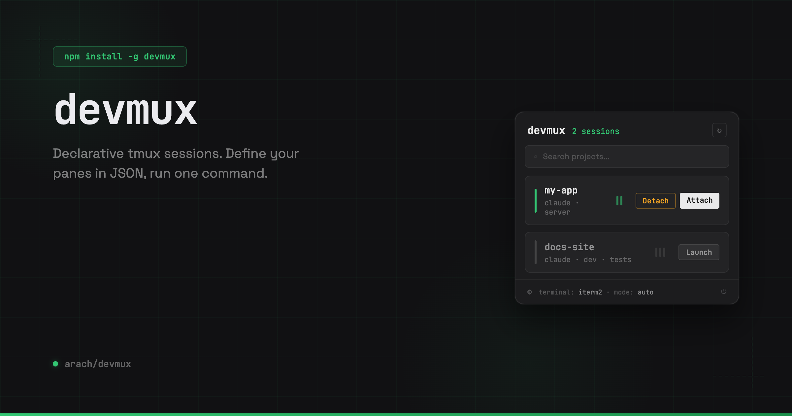

<picture>
  
</picture>

# lattices

A workspace control plane for macOS. Manage persistent terminal sessions,
tile and organize your windows, and index the text on your screen — all
controllable from the CLI or a 30-method daemon API.

## Install

```sh
npm install -g @lattices/cli
```

## Quick start

```sh
# Launch the menu bar app
lattices app

# Open the command palette from anywhere
# Cmd+Shift+M
```

## Persistent terminal sessions

Declare your dev environment in a `.lattices.json`: which panes, which
commands, what layout. Lattices builds it, runs it, and keeps it alive.
Close your laptop, reboot, come back a week later — your editor, dev
server, and test runner are exactly where you left them.

```sh
cd my-project && lattices
```

No config? It reads your `package.json` and picks the right dev command
automatically.

### Configuration

Drop a `.lattices.json` in your project root:

```json
{
  "ensure": true,
  "panes": [
    { "name": "claude", "cmd": "claude", "size": 60 },
    { "name": "server", "cmd": "pnpm dev" },
    { "name": "tests",  "cmd": "pnpm test --watch" }
  ]
}
```

### Layouts

```
2 panes              3+ panes

┌──────────┬───────┐ ┌──────────┬───────┐
│  claude  │server │ │  claude  │server │
│  (60%)   │(40%)  │ │  (60%)   ├───────┤
└──────────┴───────┘ │          │tests  │
                     └──────────┴───────┘
```

### Workspace layers

Group projects into switchable contexts. `Cmd+Option+1` tiles your
frontend and API side by side. `Cmd+Option+2` for the mobile stack.
Sessions stay alive across switches.

### Tab groups

Bundle related repos as tabs in one session. Each tab gets its own
pane layout from its `.lattices.json`.

```sh
lattices group talkie      # Launch iOS, macOS, Web, API as tabs
lattices tab talkie iOS    # Switch to the iOS tab
```

## Window tiling and awareness

A native menu bar app tracks every window across all your monitors.
Tile with hotkeys, organize into switchable layers, snap to grids.

It reads your windows too — extracting text from UI elements every
60 seconds and running Vision OCR on background windows every 2 hours.
Everything is searchable.

```sh
lattices scan                  # View current screen text
lattices scan search "error"   # Search across all indexed text
lattices scan recent           # Browse scan history
lattices scan deep             # Trigger a Vision OCR scan now
```

## A programmable desktop

The menu bar app runs a daemon with 30 RPC methods and 5 real-time
events over WebSocket. Anything you can do from the app, an agent or
script can do over the API.

```js
import { daemonCall } from '@lattices/cli/daemon-client'

// Search windows by content — title, app, session tags, OCR
const results = await daemonCall('windows.search', { query: 'myproject' })

// Launch and tile
await daemonCall('session.launch', { path: '/Users/you/dev/frontend' })
await daemonCall('window.tile', { session: 'frontend-a1b2c3', position: 'left' })

// Read the screen
await daemonCall('ocr.scan')
const errors = await daemonCall('ocr.search', { query: 'error OR failed' })
```

Or from the CLI:

```sh
lattices search myproject           # Find windows by content
lattices search myproject --deep    # Include terminal tab/process data
lattices place myproject left       # Search + focus + tile in one step
```

Claude Code skills, MCP servers, or your own scripts can drive your
desktop the same way you do.

## CLI

```
lattices                    Create or reattach to session
lattices init               Generate .lattices.json
lattices ls                 List active sessions
lattices kill [name]        Kill a session
lattices search <query>     Search windows by title, app, session, OCR
lattices search <q> --deep  Deep search: index + terminal inspection
lattices place <query> [pos]  Deep search + focus + tile
lattices focus <session>    Raise a session's window
lattices tile <position>    Tile frontmost window
lattices group [id]         Launch or attach a tab group
lattices tab <group> [tab]  Switch tab within a group
lattices scan               View current screen text
lattices scan search <q>    Search indexed text
lattices scan deep          Trigger Vision OCR now
lattices app                Launch the menu bar app
lattices help               Show help
```

## Requirements

- macOS 13.0+
- Node.js 18+

### Optional

- tmux for persistent terminal sessions (`brew install tmux`)
- Swift 5.9+ to build the menu bar app from source

## Docs

[lattices.dev/docs](https://lattices.dev/docs/overview)

## License

MIT
