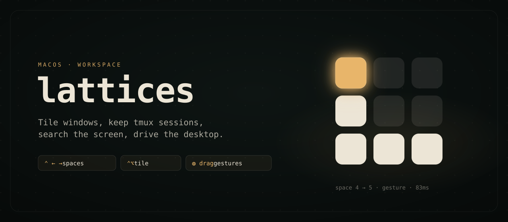

<p align="center">
  
</p>

<h1 align="center">lattices</h1>

<p align="center">
  <strong>macOS developer workspace manager.</strong><br />
  Tile windows, keep tmux sessions, search the screen, and drive the desktop from a local daemon.
</p>

<p align="center">
  <a href="https://www.npmjs.com/package/@arach/lattices"></a>
  <a href="LICENSE"></a>
  <a href="https://github.com/arach/lattices/releases/latest"></a>
  <a href="https://www.npmjs.com/package/@arach/lattices"></a>
</p>

<p align="center">
  <a href="https://lattices.dev">lattices.dev</a>
  · <a href="https://lattices.dev/docs/overview">docs</a>
  · <a href="https://github.com/arach/lattices/releases/latest">releases</a>
  · <a href="https://lattices.dev/docs/api">agent API</a>
</p>

Native Swift menu bar app (`apps/mac`) plus a TypeScript CLI (`bin/lattices.ts`). The app hosts a localhost WebSocket daemon. Agents, scripts, and the CLI use the same surface.

```
■ □ □     tile      search     spaces
■ □ □     sessions  daemon     OCR
■ ■ ■     layers    voice      agents
```

<table>
<tr>
<td><strong>Tile</strong><br>Halves, quarters, thirds, and <code>CxR</code> grids from hotkeys, CLI, or the palette.</td>
<td><strong>Search</strong><br>Titles, apps, session tags, terminal cwd, and indexed OCR.</td>
<td><strong>Spaces</strong><br>Ctrl+← / Ctrl+→ switches Spaces as an instant cut.</td>
</tr>
<tr>
<td><strong>Sessions</strong><br><code>.lattices.json</code> panes, optional tmux, ensure/prefill on reattach.</td>
<td><strong>Daemon</strong><br><code>ws://127.0.0.1:9399</code>, localhost only, no auth.</td>
<td><strong>OCR</strong><br>Vision + FTS5. Quick scan every 60s, deep scan every 2h.</td>
</tr>
<tr>
<td><strong>Layers</strong><br>Cmd+Option+1/2/3 focuses and tiles a workspace context.</td>
<td><strong>Voice</strong><br>Hyper+D; hold Option to speak (Vox, in-process on <code>:9398</code>).</td>
<td><strong>Agents</strong><br>CLI, <code>daemonCall</code>, and installable skills.</td>
</tr>
</table>

Without tmux you still get the app, tiling, layers, OCR, search, and the daemon. tmux adds persistent sessions.

## Install

macOS. Node 18+ or [Bun](https://bun.sh). The published package is `@arach/lattices` (also `@lattices/cli`).

```sh
npm install -g @arach/lattices
lattices app            # build or download the menu bar companion
```

From a checkout:

```sh
git clone https://github.com/arach/lattices
cd lattices && bun link
lattices app
```

One-shot installer (Homebrew, tmux, Bun, CLI):

```sh
curl -fsSL https://raw.githubusercontent.com/arach/lattices/main/install.sh | bash
```

`lattices app install` registers a user LaunchAgent so the companion starts at login.

Grant **Accessibility** and **Screen Recording** under System Settings → Privacy & Security. Instant Space switching, window targeting, OCR, and mouse gestures need them.

## First session

```sh
cd ~/your-project
lattices init           # writes .lattices.json
lattices app            # daemon + palette
lattices start          # create or attach (tmux); alias: lattices tmux
```

Bare `lattices` is a status screen. It does not attach.

```json
{
  "ensure": true,
  "panes": [
    { "name": "shell", "size": 60 },
    { "name": "server", "cmd": "bun dev" }
  ]
}
```

No config: two panes, shell on the left, auto-detected `dev` / `start` / `serve` / `watch` on the right (bun > pnpm > yarn > npm).

```sh
lattices search api --deep
lattices place frontend left
lattices tile right
lattices map
```

`--deep` and `--all` both search the index and live terminal tabs (cwd, titles, tmux, running commands).

## Keyboard

Hyper is Control+Option+Shift+Command. Caps Lock hold → Hyper, tap → Escape (on by default; Settings → General → Keyboard remaps).

| Shortcut | Action |
| --- | --- |
| **Ctrl+← / Ctrl+→** | Instant Space switch (Mission Control slide hotkeys stay off while this is on) |
| **Ctrl+Option+arrows** | Tile the frontmost window to a half |
| **Ctrl+Option+1 / 2 / 3** | Tile thirds |
| **Ctrl+Option+G** | 4×4 grid placement |
| **Ctrl+Option+V** | Fill an open 3×2 cell |
| **Ctrl+Option+mouse** | Aim HUD; release to tile, stay centered to cancel |
| **Cmd+Shift+M** | Command palette |
| **Ctrl+Option+Space** | Command bar |
| **Cmd+Option+1 / 2 / 3** | Switch workspace layer |
| **Hyper+L** | Studio / screen map |
| **Hyper+D** | Voice |
| **Hyper+G** | In-place window tools |
| **Hyper+5** | Omni search |
| **Ctrl+Cmd+M** | Hands-off mode |

Inside a tmux session: prefix is Ctrl+B. `d` detach, arrows move panes, `z` zoom, `[` scroll.

Only bare Ctrl+arrows are claimed for Spaces. Ctrl+Option+arrows still tile.

## Mouse

Hold a button, draw, release. Defaults live in `~/.lattices/mouse-shortcuts.json` (Settings → Shortcuts → Mouse Gestures).

| Gesture | Default |
| --- | --- |
| Middle-drag **left** / **right** | Previous / next Space |
| Middle-drag **down** | Screen map |
| Middle-drag **up** | Voice (Hyper+D) |
| Back-button **circle** | macOS area screenshot (Cmd+Shift+4) |

Browsers keep native middle-click and side-button behavior. Rules are data: `mouse.shortcuts.upsert` over the daemon, no Swift change required. See [`docs/mouse-gestures.md`](docs/mouse-gestures.md).

## Architecture

```
  agents / scripts / CLI
            │
            │  ws://127.0.0.1:9399     voice :9398
            ▼
┌───────────────────────┐     ┌─────────────┐
│  Menu bar app         │────►│  OCR        │
│  SwiftUI / AppKit     │     │  Vision+FTS5│
│  hosts the daemon     │     └─────────────┘
└───────────┬───────────┘
            │
     ┌──────┴──────┐
     ▼             ▼
  SkyLight      tmux
  Spaces        (optional)
  CG → AX → AppleScript
```

- Session names are `<basename>-<sha256-6chars>` of the absolute path. CLI (Node `crypto`) and app (Swift `CryptoKit`) must match.
- Terminal windows are found by a `[lattices:session-name]` tag in the tmux title (`set-titles-string`).
- Focus falls through CGWindowList → Accessibility → AppleScript.
- Space switching uses private SkyLight APIs loaded with `dlopen` at runtime.

```
apps/mac/     menu bar app + daemon
bin/          lattices CLI, app helper, daemon client
swift/        LatticesTerminalKit, DeckKit
docs/         user + agent docs
skills/       lattices, action, speech, blink
products/     Action and Blink (separate signed apps)
apps/site/    lattices.dev
```

## Agent API

The menu bar process binds `127.0.0.1` only. Any local process can connect. That is intentional.

```js
import { daemonCall, isDaemonRunning } from '@arach/lattices'

if (!(await isDaemonRunning())) {
  throw new Error('start the app with: lattices app')
}

await daemonCall('session.launch', { path: '/Users/you/dev/api' })
await daemonCall('window.place', { session: 'api-a1b2c3', placement: 'right' })
const hits = await daemonCall('windows.search', { query: 'api' })
```

```sh
lattices daemon status
lattices call windows.search '{"query":"api"}'
lattices call api.schema
```

Do not guess session hashes. Read them from `lattices sessions --json` or `tmux.sessions`. Full catalog: [docs/api](https://lattices.dev/docs/api).

## Product family

This repository ships three products.

| Product | Role | Root |
| --- | --- | --- |
| **Lattices** | Workspace: tiling, sessions, search, daemon | this tree |
| **[Action](https://lattices.dev/action)** | Computer use: observe, act, record | [`products/action`](products/action) |
| **[Blink](https://lattices.dev/blink)** | Spatial notes as floating panels | [`products/blink`](products/blink) |

Action and Blink stay separately signed. Do not fold them into the Lattices menu bar app. `lattices action` installs and talks to Action.app (`ws://127.0.0.1:4319`).

## Skills

```sh
npx skills add arach/lattices --all --global --yes
```

| Skill | Use |
| --- | --- |
| [`lattices`](skills/lattices/SKILL.md) | Tile, sessions, search, daemon |
| [`action`](skills/action/SKILL.md) | Observe, resolve, act, record |
| [`speech`](skills/speech/SKILL.md) | Spoken commands |
| [`blink`](skills/blink/SKILL.md) | Spatial notes |

`npx skills add arach/lattices --list` lists without installing.

## Docs

| Page | Contents |
| --- | --- |
| [Quickstart](https://lattices.dev/docs/quickstart) | Install and first session |
| [App](https://lattices.dev/docs/app) | Palette, tiling, settings, terminals |
| [Config](https://lattices.dev/docs/config) | `.lattices.json`, CLI, tile slots |
| [Concepts](https://lattices.dev/docs/concepts) | Naming, tags, SkyLight, ensure/prefill |
| [Layers](https://lattices.dev/docs/layers) | Layers and tab groups |
| [OCR](https://lattices.dev/docs/ocr) | Scan, search, agent usage |
| [API](https://lattices.dev/docs/api) | Daemon RPC |
| [Agents](https://lattices.dev/docs/agents) | Agent-facing artifacts |

`lattices help` for the CLI. In-repo: `docs/`, `AGENTS.md`.

## Develop

```sh
bun link
bun run check           # tsc + Swift app build
bun run test            # CLI + dependency-free tests
lattices app build      # rebuild the companion
```

App package: `apps/mac` (macOS 26+). CLI runs on Node 18+ or Bun.

## License

[MIT](LICENSE)
