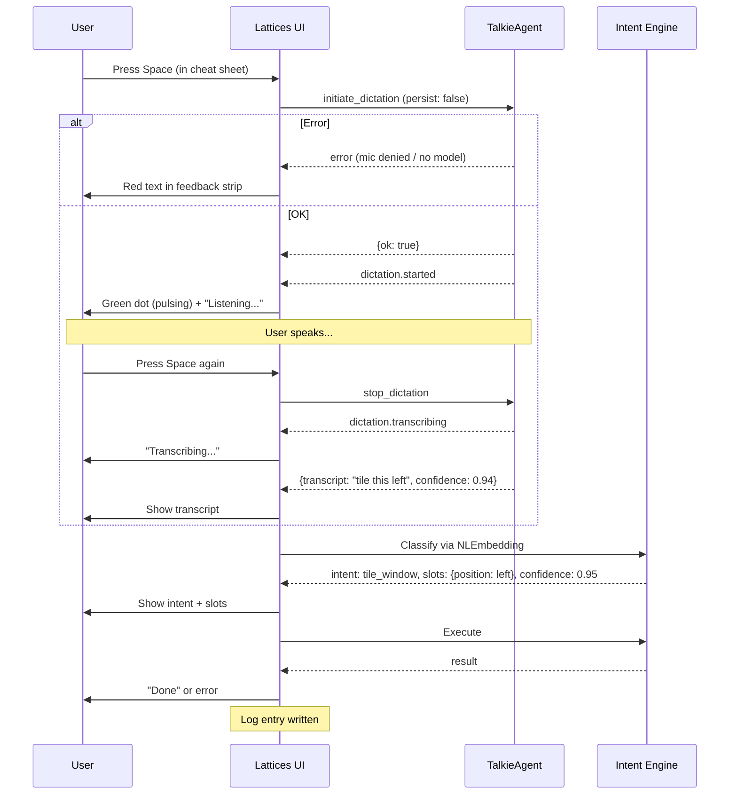

# Voice Command Protocol — Lattices ↔ TalkieAgent

## Overview

Lattices delegates all audio capture and transcription to TalkieAgent via WebSocket JSON-RPC. Lattices never accesses the microphone directly — it borrows TalkieAgent's mic and transcription pipeline, receives English text back, and routes it through its own intent engine.

These dictations are **ephemeral** — TalkieAgent does not persist them as memos, sync them, or add them to Talkie's history. Lattices is just using TalkieAgent as a transcription pipe.

## Talkie Process Model

Talkie consists of three independent processes:

| Process | Role | Relevance to Lattices |
|---|---|---|
| **Talkie.app** | Main UI — menu bar, notch visualization, memo history | None |
| **TalkieAgent** | Background service — mic access, recording, hotkeys, orchestrates transcription, state notifications | **This is what Lattices connects to** |
| **TalkieEngine** | Transcription engine — runs Whisper models, called by TalkieAgent internally | Indirect — TalkieAgent delegates to it |

TalkieAgent is the right target because:
- It owns the mic and recording lifecycle
- It's the long-running background process (always up when Talkie is installed)
- It already orchestrates the record → transcribe → result pipeline
- It's easy to discover via its existing DistributedNotification

## Service Discovery

Lattices never hardcodes ports. Discovery uses two mechanisms:

### 1. Well-known file (at rest)

TalkieAgent writes its service configuration on startup:

```
~/.talkie/services.json
```

```json
{
  "agent": {"port": 19823, "pid": 48209},
  "engine": {"port": 19821, "pid": 48210},
  "sync": {"port": 19820, "pid": 48208},
  "inference": {"port": 19822, "pid": 48212}
}
```

Lattices reads `agent.port` from this file. If the file doesn't exist, Talkie isn't installed.

### 2. DistributedNotification (live discovery)

TalkieAgent posts when it comes online:

```
Notification: com.jdi.talkie.agent.live.ready
UserInfo:     {"agentPort": 19823, "pid": 48209}
```

Lattices subscribes to this on startup. Handles:
- **Talkie launches after Lattices** — Lattices picks up the port dynamically
- **Talkie restarts** — Lattices reconnects with the new port
- **Port changes** — no stale config

### 3. Health check

After discovering a port, Lattices confirms TalkieAgent is alive:

```json
→ {"id": "hc", "method": "ping"}
← {"id": "hc", "result": {"pong": true}}
```

If ping fails, Lattices marks voice as unavailable and retries on the next `live.ready` or after ~30 seconds.

### When TalkieAgent is not running

- Footer shows `[Space] Voice (unavailable)` in muted text
- Pressing Space shows: "Voice commands require Talkie"
- No log spam — just a quiet unavailable state
- Lattices keeps listening for `live.ready` and re-checks `services.json` periodically (~30s)
- The moment TalkieAgent comes online, voice becomes available — no restart needed

## Protocol

### Wire Format

Uses TalkieAgent's JSON-RPC format over WebSocket:

```
Request:  {"id": "...", "method": "...", "params": {...}}
Response: {"id": "...", "result": {...}}  or  {"id": "...", "error": "..."}
Event:    {"event": "...", "data": {...}}   (server push, no id)
```

### Methods (Lattices → TalkieAgent)

**`initiate_dictation`** — Start recording from the mic.

```json
{"id": "1", "method": "initiate_dictation", "params": {
  "source": "lattices",
  "persist": false
}}
```

- `source` — identifies the caller (for TalkieAgent's logging/UI)
- `persist: false` — do not save as a memo, do not sync, do not show in Talkie history

Response (immediate ack):
```json
{"id": "1", "result": {"ok": true}}
```

Error responses:
```json
{"id": "1", "error": "Microphone access denied"}
{"id": "1", "error": "No model loaded"}
```

**`stop_dictation`** — Stop recording and return the transcript.

```json
{"id": "2", "method": "stop_dictation"}
```

Response (after transcription completes):
```json
{"id": "2", "result": {
  "transcript": "tile this left",
  "confidence": 0.94,
  "durationMs": 1820
}}
```

**`cancel_dictation`** — Abort without transcribing.

```json
{"id": "3", "method": "cancel_dictation"}
```

```json
{"id": "3", "result": {"ok": true}}
```

### Events (TalkieAgent → Lattices)

Pushed over the WebSocket connection during an active dictation.

| Event | When | Data |
|---|---|---|
| `dictation.started` | Mic is hot, recording has begun | `{"source": "lattices"}` |
| `dictation.transcribing` | Recording stopped, model is running | `{}` |
| `dictation.result` | Transcription complete | `{"transcript": "...", "confidence": 0.94, "durationMs": 1820}` |
| `dictation.error` | Something failed during recording or transcription | `{"message": "..."}` |

## End-to-End Lifecycle



## UI States

| State | Feedback strip | Footer |
|---|---|---|
| **Idle** | Hidden | `[Space] Voice  [ESC] Dismiss` |
| **Unavailable** | Hidden | `[Space] Voice (unavailable)  [ESC] Dismiss` |
| **Error** | Red: "Mic access denied" or "Talkie not running" | `[ESC] Dismiss` |
| **Listening** | Green dot + "Listening..." | `[Space] Stop  [ESC] Cancel` |
| **Transcribing** | "Transcribing..." | `[ESC] Cancel` |
| **Result** | `"tile this left"` → `tile window · position: left` → `Done` | `[Space] New  [ESC] Dismiss` |

## Logging

Every voice command produces a diagnostic log entry:

```
[voice] "tile this left" → tile_window(position: left) → ok (conf=0.95, 1820ms)
[voice] "organize my stuff" → distribute() → ok (conf=0.79, 2100ms)
[voice] "do something weird" → (no match, conf=0.41, 900ms)
[voice] error: TalkieAgent not running
```

## Implementation Scope

### Lattices side
- Replace `AVAudioRecorder` in `TalkieAudioProvider` with WebSocket RPC calls to TalkieAgent
- Remove mic entitlement and `NSMicrophoneUsageDescription` (Lattices never touches the mic)
- Add service discovery (read `~/.talkie/services.json` + listen for `live.ready`)
- Update UI states in cheat sheet feedback strip

### TalkieAgent side (separate repo)
- Expose a WebSocket bridge (or add methods to existing bridge)
- Add `initiate_dictation`, `stop_dictation`, `cancel_dictation` handlers
- Emit `dictation.started`, `dictation.transcribing`, `dictation.result`, `dictation.error` events
- Honor `persist: false` — skip memo creation and sync
- Write `~/.talkie/services.json` on startup (all service ports)
- Include `agentPort` in `live.ready` notification userInfo
